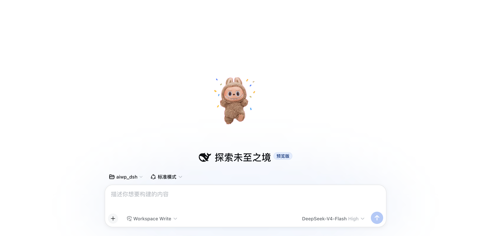

# DSH UI Confirmo 桌宠

在 [DeepSeek Harness (DSH)](https://github.com/deepseek-ai/deepseek-harness) 的 Web UI 里复刻
[confirmo.love](https://confirmo.love/) 的桌宠体验：一只会动、可拖拽、可换形象的 AI 编码小伙伴，
并支持 [sprites.confirmo.love](https://sprites.confirmo.love/) 社区精灵图。

> 交互、视觉与素材规范均致敬 confirmo.love 及其社区精灵图画廊。

## 📸 效果预览

| 待机 | 拖拽 | 工作状态 |
|---|---|---|
|  |  |  |

| 开心 | 兴奋 | 睡觉 |
|---|---|---|
|  |  |  |

## ✨ 功能

### 7 个精灵状态

每个 sprite 是 **8 列 × 7 行 = 56 帧** 的精灵图，每行一个动画：

| 行 | 状态 | 触发方式 |
|---|---|---|
| Row 1 | 待机 Idle | 默认基础状态 |
| Row 2 | 开心 Happy | **单击**（250ms 手势窗口确认） |
| Row 3 | 兴奋 Excited | **双击** + 整体弹跳 |
| Row 4 | 睡觉 Sleepy | **5 分钟无 agent 动作/宠物交互**自动入睡，3 个 Z 飘动 |
| Row 5 | 工作 Working | 检测到 DSH agent 运行自动切换，齿轮 + 三点加载 + 上飘代码符号 |
| Row 6 | 生气 Angry | **快速连点 5 次** / agent 运行出错 / sprite 加载失败 |
| Row 7 | 拖拽 Dragging | 按住拖动 |

- 手势用**延迟提交（250ms 去抖窗口）**区分单击/双击/连点，不依赖浏览器 `dblclick` 事件
- 状态互斥：工作中/兴奋动画播放中单击不响应；连点 5 次仍可升级为生气
- 任务完成时播放「兴奋(远近缩放) → 开心」庆祝 + 「搞定! ✓」气泡
- 右键菜单含 7 个状态按钮，可 **10 秒预览**每个状态（可被交互打断）

### 社区 sprite 支持

- **在线拉取清单**：菜单支持实时显示社区最新 sprite
- **分层本地缓存**：缓存正在使用的 sprite，提升加载速度
- **抠图**：纯品红 `#ff00ff` 背景自动抠除，移植官网画廊同款流水线，对非标准品红背景（如深紫）也鲁棒
- **空闲预取**：启动预热 + 入睡时用空闲带宽逐个补齐磁盘缓存

### 交互与细节

- 拖拽移动（位置持久化）；右键菜单切换形象 / 大小（96/128/160）/ 状态预览
- 默认位置左下角；形象、位置、大小存于 `localStorage`
- 菜单缩略图统一（processed 缩略图优先，缺失时 canvas 抠图兜底）、深色主题适配
- 尊重系统 `prefers-reduced-motion`

## 📦 安装

```bash
git clone <your-repo-url> confirmo
cd confirmo
./install.sh
```

脚本会：把插件包拷贝到 `~/.dsh/profiles/node_modules/dsh-plugin-confirmo/`、在两个 profile
的 `cordis.patch.yml` 插入 `confirmo` 注册段、给 web profile 建符号链接。

**然后重启 DSH Desktop**（插件集变更需要重启，client-modules 的包元数据缓存设计）。
重启后 `window.__DSH_BOOT__` 会包含 `dsh-plugin-confirmo` 条目，浏览器自动加载桌宠。
node 端路由（`/confirmo/sprites`、`/confirmo/sprite`）也随重启注册。

## 🔧 开发

```bash
node dsh-plugin-confirmo/build.js   # 从 client.src.js + sprite_list.json 生成 lib/client.js
```

`lib/client.js` 是浏览器端 bundle（`window.__ModuleLoader__.load(...)` 格式），由
`lib/client.src.js`（源码）+ `sprite_list.json`（内置 sprite 快照）构建而来。

**改动流程**：改 `client.src.js` → `node build.js` → `cp lib/client.js
~/.dsh/profiles/node_modules/dsh-plugin-confirmo/lib/client.js` → 刷新页面生效
（改 `index.js` 才需要重启 DSH Desktop）。

手动更新内置 sprite 快照（可选）：

```bash
curl -s "https://api.sprites.confirmo.love/sprites?page=1&limit=20&sort=trending" -o /tmp/trending.json
# 处理后覆盖 sprite_list.json, 再 node build.js
```

## 🗑️ 卸载

```bash
cd confirmo
./uninstall.sh
```

删除插件包、web 链接和两处 cordis.patch.yml 注册段，重启 DSH Desktop 生效。

## 📁 文件结构

```
confirmo/
├── LICENSE
├── README.md
├── install.sh / uninstall.sh
├── docs/
│   ├── screenshots/         # 效果预览截图（README 引用）
│   ├── sprites/             # 社区 sprite 素材（git 排除, 用 download-sprites.mjs 重新下载）
│   └── submission/          # 1024Store 插件市场投稿文件
└── dsh-plugin-confirmo/
    ├── package.json        # 声明 dsh.bundle.patch + dsh.client (platform: web), 导出 ./client
    ├── cordis.patch.yml    # bundle patch: 注册 confirmo 插件到 cordis 配置
    ├── sprite_list.json    # 内置 sprite 快照(60 个热门 sprite 的 URL 清单)
    ├── build.js            # 构建脚本
    └── lib/
        ├── index.js        # node 端:/confirmo/sprites 清单代理 + /confirmo/sprite 磁盘缓存路由
        ├── client.src.js   # 浏览器端源码(猫咪 SVG + 抠图 + 播放引擎 + 手势 + 缓存 + 菜单)
        └── client.js       # 构建产物(ModuleLoader bundle)
```

## 📜 致谢与声明

- 复刻自 [confirmo.love](https://confirmo.love/) 的交互体验与视觉风格，精灵图规范来自
  [sprites.confirmo.love](https://sprites.confirmo.love/) 社区（完整规范见 [`docs/sprite-spec.md`](docs/sprite-spec.md)）
- 精灵图素材版权归各自作者所有；本项目仅嵌入其 URL 清单，运行时从官方服务器加载
- 本项目为独立开源实现，与 confirmo.love 无隶属关系

## ⚖️ License

[MIT](LICENSE)
